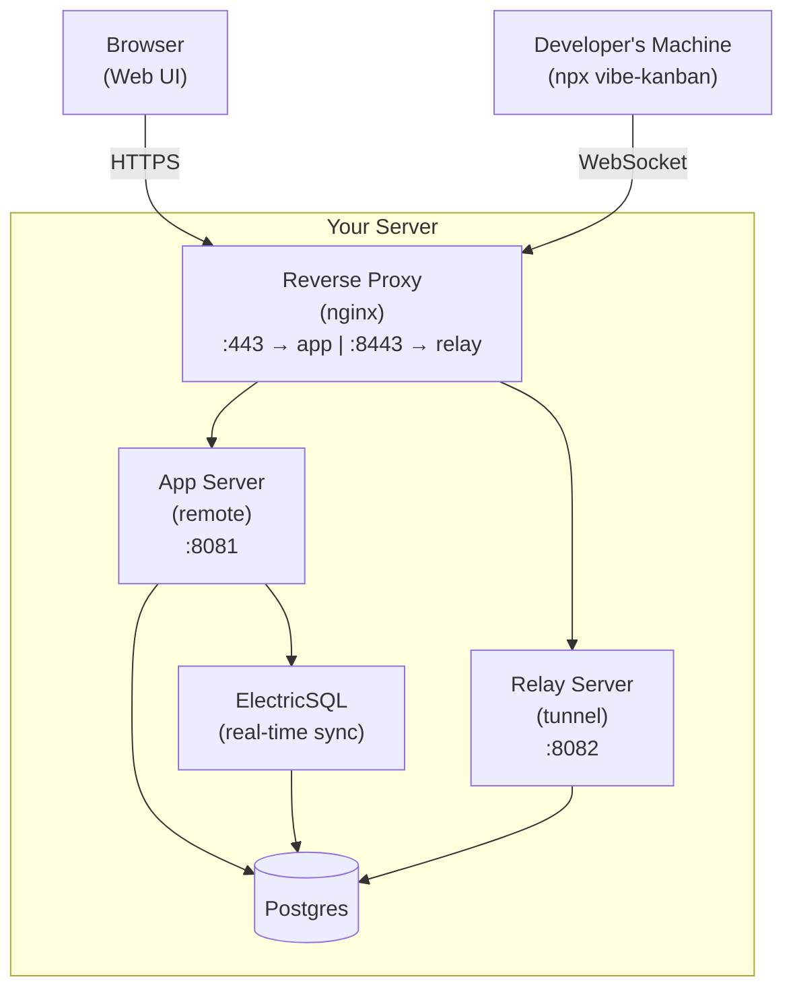
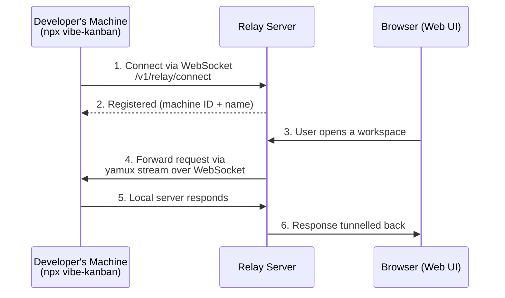
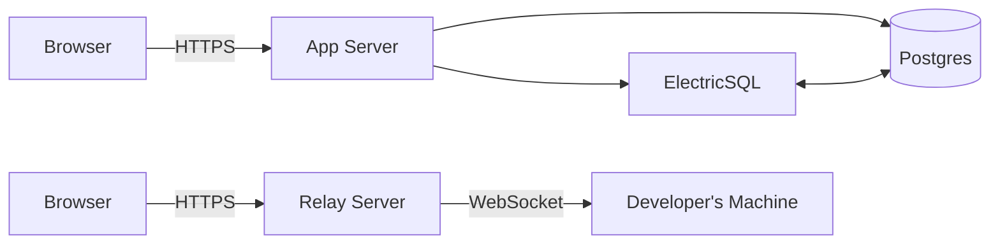

# How it works

## Overview

## How the relay tunnel works

The relay lets the web UI control local machines that aren't directly reachable (behind NAT, firewalls, etc.).

**Key points:**
- The local machine connects *outward* to the relay — no inbound ports needed
- One long-lived WebSocket carries all traffic via multiplexing (yamux)
- The relay server authenticates connections using the same JWT as the app
- Multiple local machines can connect simultaneously, each with a unique ID

## Data flow

- **App server** handles auth, API, and serves the web UI
- **ElectricSQL** syncs data in real-time between Postgres and connected clients
- **Relay server** tunnels HTTP traffic to local machines for remote access
- **Postgres** stores everything — users, orgs, projects, issues, invitations
