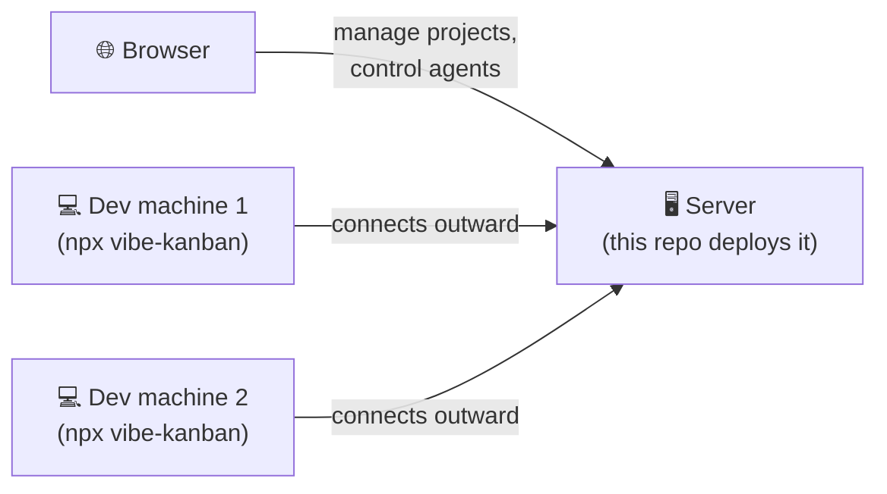
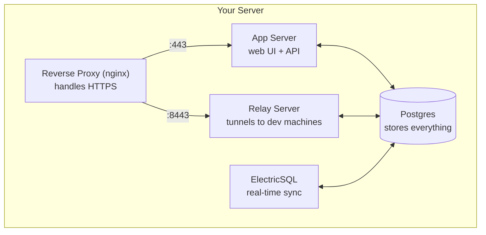
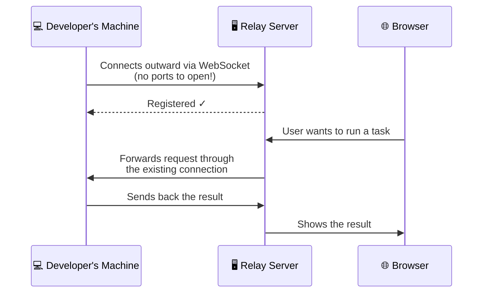

# vibekanban-deploy

Self-hosted [Vibe Kanban](https://github.com/BloopAI/vibe-kanban) deployment kit.

## What is Vibe Kanban?

Vibe Kanban is a project management tool (like Jira or Linear) that can also control coding agents on your developers' machines — all from the browser.

It has two parts:

- **The server** (what this repo deploys) — a web app where your team manages projects, issues, and kanban boards
- **The local agent** (runs on each developer's machine) — manages git repos and runs tasks locally, controlled from the server's web UI

The server and local agents talk through a **relay tunnel**, so developers don't need to open any ports — the local agent connects outward to the server.



### What runs on the server?



### How does the relay tunnel work?

The relay lets the browser control local machines that aren't directly reachable (behind NAT, firewalls, home networks, etc.).



**The key idea:** the developer's machine connects *out* to the server — not the other way around. This means it works through firewalls and NAT without any port forwarding.

## Quick start

```bash
vim config.sh           # set your URLs and auth credentials
./setup.sh              # clones repo, generates secrets + cert
./up.sh                 # builds and starts everything
```

Open your `APP_URL` and accept the cert warning (if using self-signed).

## Deployment modes

### LAN with self-signed certs (default)

Set IP-based URLs and leave the built-in proxy enabled:

```sh
APP_URL=https://192.168.1.177
RELAY_URL=https://192.168.1.177:8443
PROXY_ENABLED=true
```

### Domain with your own reverse proxy

Point your proxy at the app (port 8081) and relay (port 8082), and disable the built-in one:

```sh
APP_URL=https://kanban.example.com
RELAY_URL=https://relay.kanban.example.com
PROXY_ENABLED=false
```

Your reverse proxy needs to support WebSocket upgrades for the relay. Example nginx config:

```nginx
server {
    listen 443 ssl;
    server_name kanban.example.com;
    # ... your TLS config ...
    location / {
        proxy_pass http://127.0.0.1:8081;
        proxy_http_version 1.1;
        proxy_set_header Upgrade $http_upgrade;
        proxy_set_header Connection "upgrade";
    }
}

server {
    listen 443 ssl;
    server_name relay.kanban.example.com;
    # ... your TLS config ...
    location / {
        proxy_pass http://127.0.0.1:8082;
        proxy_http_version 1.1;
        proxy_set_header Upgrade $http_upgrade;
        proxy_set_header Connection "upgrade";
    }
}
```

## Scripts

| Script | What it does |
|--------|-------------|
| `setup.sh` | Clones vibekanban, generates `.env` and self-signed cert from `config.sh` |
| `up.sh` | Builds and starts all containers |
| `down.sh` | Stops all containers (pass `--volumes` to delete data) |
| `logs.sh` | Tails container logs (pass service name to filter) |
| `invite.sh` | Lists pending invite links (no email service needed) |

## Configuration

All settings live in `config.sh`. After editing, delete `.env` and re-run `./setup.sh` to apply.

See `config.sh` for the full list of options — only `APP_URL`, `RELAY_URL`, and one auth method are required. Everything else (email, attachments, billing, observability, etc.) is optional and disabled by default.

## Authentication

Set at least one in `config.sh`:

**Local auth** (simplest) — set `SELF_HOST_LOCAL_AUTH_EMAIL` and `SELF_HOST_LOCAL_AUTH_PASSWORD`. Creates a bootstrap admin account on first start. No external services needed.

### GitHub OAuth

1. Go to https://github.com/settings/developers
2. Click **New OAuth App**
3. Fill in:
   - **Application name**: anything (e.g. "Vibe Kanban")
   - **Homepage URL**: your `APP_URL`
   - **Authorisation callback URL**: `<APP_URL>/v1/oauth/github/callback`
4. Click **Register application**
5. Copy the **Client ID** and generate a **Client Secret**
6. Set `GITHUB_OAUTH_CLIENT_ID` and `GITHUB_OAUTH_CLIENT_SECRET` in `config.sh`

### Google OAuth

1. Go to https://console.cloud.google.com/apis/credentials
2. Create a project if you don't have one
3. Go to **OAuth consent screen**, select **External**, fill in the app name and your email, then save
4. Go to **Credentials** → **Create Credentials** → **OAuth client ID**
5. Select **Web application**
6. Under **Authorised redirect URIs**, add: `<APP_URL>/v1/oauth/google/callback`
7. Click **Create**
8. Copy the **Client ID** and **Client Secret**
9. Set `GOOGLE_OAUTH_CLIENT_ID` and `GOOGLE_OAUTH_CLIENT_SECRET` in `config.sh`

## Connect local machines

On each developer's machine:

```bash
VK_SHARED_API_BASE=<APP_URL> \
VK_SHARED_RELAY_API_BASE=<RELAY_URL> \
npx vibe-kanban
```

After logging in, the relay tunnel connects automatically — the remote web UI can then control local git repos.

If using self-signed certs, visit the `RELAY_URL` once in the browser to accept the cert warning.

## Optional integrations

These are all disabled by default. Set the relevant values in `config.sh` to enable them.

### GitHub App

Deeper GitHub integration — webhooks, automated actions, and PR workflows. Different from GitHub OAuth (which is just for login).

1. Follow the [GitHub App creation guide](https://docs.github.com/en/apps/creating-github-apps/registering-a-github-app/registering-a-github-app)
2. Set `GITHUB_APP_ID`, `GITHUB_APP_PRIVATE_KEY`, `GITHUB_APP_WEBHOOK_SECRET`, and `GITHUB_APP_SLUG` in `config.sh`

### Email notifications (Loops)

Sends invite emails and review notifications. Without this, everything still works — you just share invite links manually using `./invite.sh`.

1. Sign up at [Loops](https://loops.so)
2. Create transactional email templates for invites, review ready, and review failed
3. Set `LOOPS_EMAIL_API_KEY` and the template IDs in `config.sh`

### File attachments (Azure Blob Storage)

Enables file uploads on issues. Works with Azure Blob Storage or any S3-compatible service (e.g. [MinIO](https://min.io)) via the endpoint URL override.

1. Create a storage account and container ([Azure quickstart](https://learn.microsoft.com/en-us/azure/storage/blobs/storage-quickstart-blobs-portal))
2. Set the `AZURE_STORAGE_*` values in `config.sh`

### Code review artifacts (Cloudflare R2)

Stores code review output. Only needed if you use the review feature.

1. Create an R2 bucket ([Cloudflare R2 docs](https://developers.cloudflare.com/r2/get-started/))
2. Create an API token with read/write access
3. Set the `R2_*` values in `config.sh`

### Billing (Stripe)

Only relevant if you want to charge for team seats.

1. Get your API keys from the [Stripe dashboard](https://dashboard.stripe.com/apikeys)
2. Create a price for team seats
3. Set the `STRIPE_*` values in `config.sh`

### Observability

Error tracking and analytics — totally optional.

- **Sentry**: set `SENTRY_DSN_REMOTE` ([Sentry docs](https://docs.sentry.io))
- **PostHog**: set `POSTHOG_API_KEY` and `POSTHOG_API_ENDPOINT` ([PostHog docs](https://posthog.com/docs))
- **Azure App Insights**: set `APPLICATIONINSIGHTS_CONNECTION_STRING` ([App Insights docs](https://learn.microsoft.com/en-us/azure/azure-monitor/app/app-insights-overview))

## Further reading

- [Vibe Kanban documentation](https://vibekanban.com/docs)
- [Official Docker deployment guide](https://vibekanban.com/docs/self-hosting/deploy-docker)
- [GitHub integration](https://vibekanban.com/docs/integrations/github)
- [MCP servers](https://vibekanban.com/docs/integrations/mcp-servers)
- [Supported coding agents](https://vibekanban.com/docs/agents)
- [Code review](https://vibekanban.com/docs/code-review)
- [Troubleshooting](https://vibekanban.com/docs/troubleshooting)

## Updating

```bash
cd vibekanban && git pull && cd ..
./up.sh
```

## Default ports

| Port | Service | Configurable via |
|------|---------|-----------------|
| 443 | Web UI (proxied) | `HTTPS_PORT` |
| 8443 | Relay tunnel (proxied) | `RELAY_PORT` |
| 8081 | App (direct, when `PROXY_ENABLED=false`) | `HTTPS_PORT` |
| 8082 | Relay (direct, when `PROXY_ENABLED=false`) | `RELAY_PORT` |
