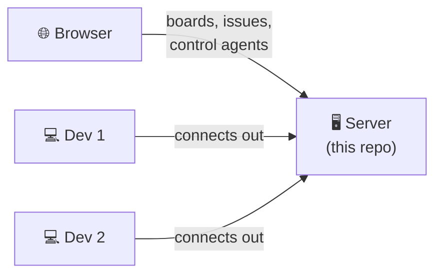
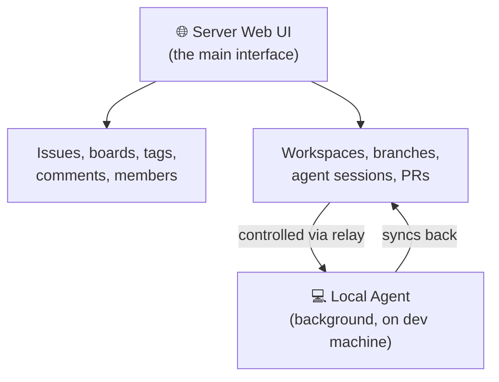
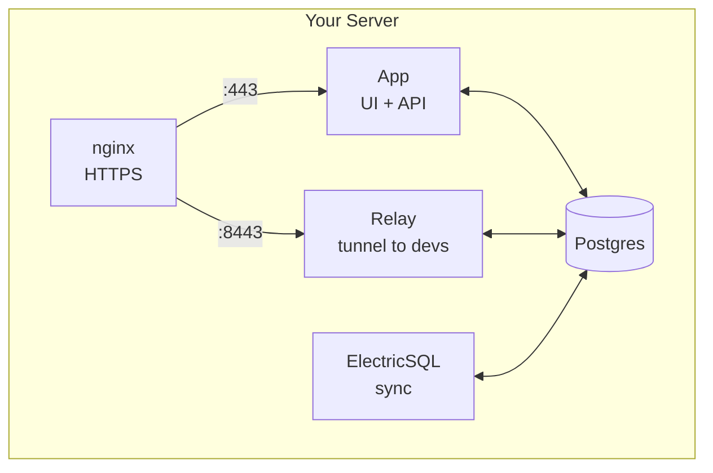
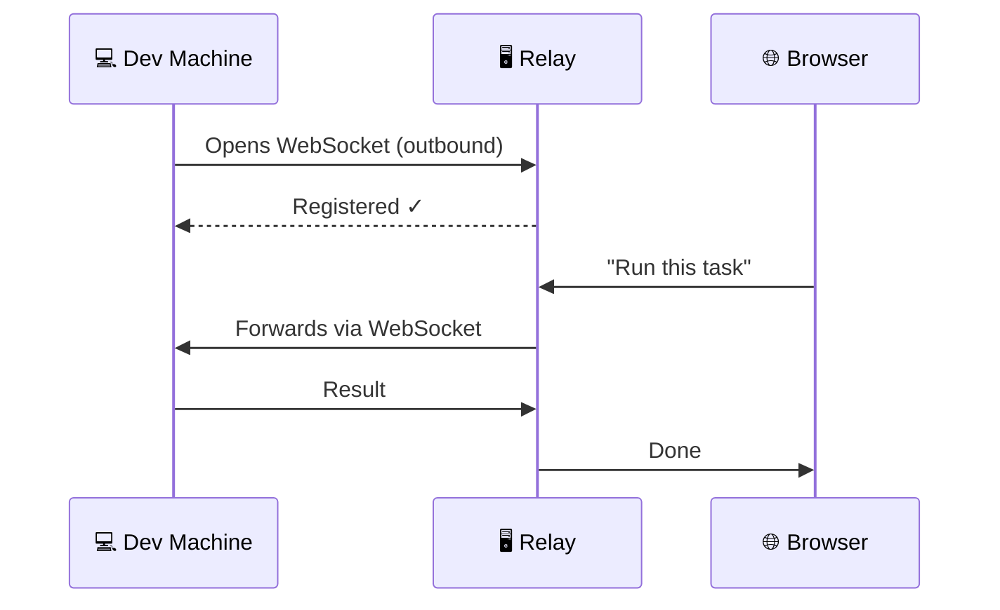

# vibekanban-deploy

> Deploy [Vibe Kanban](https://github.com/BloopAI/vibe-kanban) on your own server in 3 commands.

## TL;DR

```bash
vim config.sh    # set your URL + pick a login method
./setup.sh       # clones repo, generates secrets + cert
./up.sh          # done — open your APP_URL
```

---

## What is this?

Vibe Kanban = project management (like Jira) + remote control of coding agents on dev machines.



**Two parts:**
- **Server** (this repo deploys it) — the web UI where you do everything: manage projects, issues, kanban boards, and control coding agents on dev machines
- **Local agent** (`npx vibe-kanban`) — runs on each dev machine, connects outward to the server. No ports to open.

### How do you use it?

Everything happens in the **server web UI**. Once a dev machine connects via the local agent, you can see and control it from the browser — create workspaces, run agents, manage branches, push PRs.

The local agent just runs in the background. It doesn't need its own UI for daily use.



| What | Where |
|------|-------|
| Create issues, manage boards | Server web UI |
| Invite team members | Server web UI |
| Create workspaces, run agents | Server web UI (controls remote agents) |
| Git operations, branches, PRs | Server web UI → local agent executes |
| Agent conversations, logs | Visible in server UI, stored on dev machine |

> **Note:** each dev only sees workspaces from their own connected machines. Team members see their own.

---

## What's inside the server?



| Container | Job |
|-----------|-----|
| **App** | Web UI, API, auth |
| **Relay** | Tunnels browser requests to dev machines |
| **Postgres** | Stores everything |
| **ElectricSQL** | Real-time sync |
| **nginx** | HTTPS termination |

---

## How does the relay work?

> Dev machines connect *out* to the server. No port forwarding needed.



---

## Deployment options

### Option A: LAN (default)

Self-signed cert, access by IP.

```sh
APP_URL=https://192.168.1.177
RELAY_URL=https://192.168.1.177:8443
PROXY_ENABLED=true
```

### Option B: Domain + external proxy (recommended)

Keep the built-in proxy and point your external one (Caddy, Cloudflare, etc.) at it:

```sh
APP_URL=https://kanban.example.com
RELAY_URL=https://relay.kanban.example.com
PROXY_ENABLED=true
CERT_EXTRA_SANS="192.168.1.177"  # so the self-signed cert works for your proxy too
```

Then in your external proxy:
- `kanban.example.com` → `https://<server-ip>:443`
- `relay.kanban.example.com` → `https://<server-ip>:8443`

### Option C: Domain, no built-in proxy

Your proxy talks directly to the backend over HTTP:

```sh
APP_URL=https://kanban.example.com
RELAY_URL=https://relay.kanban.example.com
PROXY_ENABLED=false
```

Point your proxy at `http://127.0.0.1:8081` (app) and `http://127.0.0.1:8082` (relay). The relay needs WebSocket upgrade support:

```nginx
location / {
    proxy_pass http://127.0.0.1:8082;
    proxy_http_version 1.1;
    proxy_set_header Upgrade $http_upgrade;
    proxy_set_header Connection "upgrade";
}
```

---

## Scripts

| Script | What it does |
|--------|-----|
| `setup.sh` | Clones repo, generates secrets + cert |
| `up.sh` | Starts everything |
| `down.sh` | Stops everything (`--volumes` to wipe data) |
| `logs.sh` | Tail logs (pass service name to filter) |
| `invite.sh` | Show pending invite links |
| `connect.sh` | Print the command to connect a dev machine |

---

## Configuration

Everything is in **`config.sh`**. After editing: `rm .env && ./setup.sh && ./up.sh`

Only `APP_URL`, `RELAY_URL`, and one login method are required. The rest is optional.

---

## Login methods

### Local auth (for bootstrapping)

Disabled by default. Uncomment in `config.sh` if you need a quick admin account without setting up OAuth first:

```sh
SELF_HOST_LOCAL_AUTH_EMAIL=admin@example.com
SELF_HOST_LOCAL_AUTH_PASSWORD=changeme
```

> **Good to know:** this isn't a permanent account. The server checks these env vars on every startup. Comment them out again → local auth is disabled. Your user account stays, but nobody can log in via email/password anymore.

**Recommended flow:** enable local auth → deploy → log in → set up OAuth → disable local auth → redeploy.

### GitHub OAuth

1. https://github.com/settings/developers → **New OAuth App**
2. **Homepage URL**: your `APP_URL`
3. **Callback URL**: `<APP_URL>/v1/oauth/github/callback`
4. Copy Client ID + Client Secret → `config.sh`

### Google OAuth

1. https://console.cloud.google.com/apis/credentials
2. Create project → **OAuth consent screen** (External) → save
3. **Credentials** → **Create** → **OAuth client ID** → Web application
4. **Redirect URI**: `<APP_URL>/v1/oauth/google/callback`
5. Copy Client ID + Client Secret → `config.sh`

---

## Connect dev machines

On each developer's machine:

```bash
VK_SHARED_API_BASE=<APP_URL> \
VK_SHARED_RELAY_API_BASE=<RELAY_URL> \
npx vibe-kanban
```

Self-signed cert? Visit the `RELAY_URL` in a browser first to accept the warning.

---

## Updating

```bash
cd vibekanban && git pull && cd ..
./up.sh
```

---

<details>
<summary><strong>Optional integrations</strong> (click to expand)</summary>

All disabled by default. Set values in `config.sh` to enable.

### GitHub App
Webhooks, automated actions, PR workflows. ([setup guide](https://docs.github.com/en/apps/creating-github-apps/registering-a-github-app/registering-a-github-app))

### Email — Loops
Invite emails + review notifications. Without it, use `./invite.sh` to share links manually. ([loops.so](https://loops.so))

### File attachments — Azure Blob Storage
Issue file uploads. Also works with S3-compatible services like [MinIO](https://min.io). ([Azure quickstart](https://learn.microsoft.com/en-us/azure/storage/blobs/storage-quickstart-blobs-portal))

### Code review — Cloudflare R2
Stores review artifacts. ([R2 docs](https://developers.cloudflare.com/r2/get-started/))

### Billing — Stripe
Charge for team seats. ([Stripe dashboard](https://dashboard.stripe.com/apikeys))

### Observability
- [Sentry](https://docs.sentry.io) — `SENTRY_DSN_REMOTE`
- [PostHog](https://posthog.com/docs) — `POSTHOG_API_KEY`
- [Azure App Insights](https://learn.microsoft.com/en-us/azure/azure-monitor/app/app-insights-overview) — `APPLICATIONINSIGHTS_CONNECTION_STRING`

</details>

---

<details>
<summary><strong>Ports reference</strong></summary>

| Port | Service | Config |
|------|---------|--------|
| 443 | Web UI (proxied) | `HTTPS_PORT` |
| 8443 | Relay (proxied) | `RELAY_PORT` |
| 8081 | App (direct) | when `PROXY_ENABLED=false` |
| 8082 | Relay (direct) | when `PROXY_ENABLED=false` |

</details>

---

## Further reading

[Docs](https://vibekanban.com/docs) · [Docker guide](https://vibekanban.com/docs/self-hosting/deploy-docker) · [GitHub integration](https://vibekanban.com/docs/integrations/github) · [MCP servers](https://vibekanban.com/docs/integrations/mcp-servers) · [Agents](https://vibekanban.com/docs/agents) · [Code review](https://vibekanban.com/docs/code-review) · [Troubleshooting](https://vibekanban.com/docs/troubleshooting)
